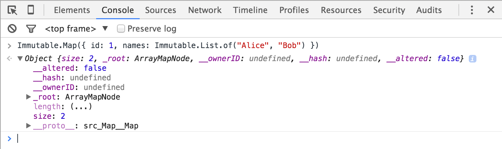
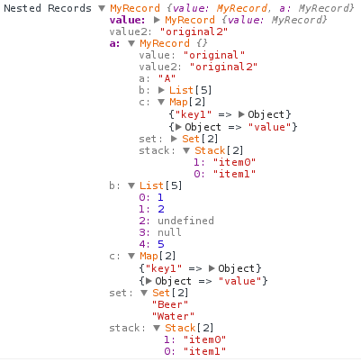

# Immutable-js Dev Tools

The [Immutable](https://immutable-js.com/) library is fantastic, but inspecting immutable collections in browser's Dev Tools is awkward. You only see the internal data structure, not the logical contents. For example, when inspecting the contents of an Immutable List, you'd really like to see the items in the list.

Chrome (v47+) and Firefox (116+) has support for custom "formatters". A formatter tells browser's Dev Tools how to display values in the Console, Scope list, etc. This means we can display Lists, Maps and other collections, in a much better way.

Essentially, it turns this:



into:



This library provides a formatter and a browser extension to do just that.

## Features

The library currently has formatters for:

- [x] `List`
- [x] `Map` & `OrderedMap`
- [x] `Set` & `OrderedSet`
- [x] `Stack`
- [x] `Record`
- [ ] `Range` (let me know if you use this :-), add :+1: to [#21](https://github.com/andrewdavey/immutable-devtools/issues/21))
- [ ] `Repeat` (if you wish this, add :+1: to [#22](https://github.com/andrewdavey/immutable-devtools/issues/22))
- [ ] `Seq` — I do not have an idea how to display it. If you know, [write it down into #23](https://github.com/andrewdavey/immutable-devtools/issues/23)

Want something more? [Write down your wishes!](https://github.com/immutable-js/immutable-devtools/issues/new)

## Installation

Chrome v47+ / Firefox v116+

In Dev Tools, press F1 to load the Settings. Scroll down to the Console section and tick "Enable custom formatters".


### Browser Extension

You can directly install the browser extension for Chrome or Firefox. It automatically installs the formatters when you open the DevTools.

- Firefox: https://addons.mozilla.org/fr/firefox/addon/immutable-js-console-formatter/
- Chrome (not working for now): https://chrome.google.com/webstore/detail/immutablejs-object-format/hgldghadipiblonfkkicmgcbbijnpeog

### Install in project

Then, in your project, install via npm:

```
npm install --save-dev @jdeniau/immutable-devtools
```

And enable with:

```js
import * as Immutable from 'immutable';
import installDevTools = '@jdeniau/immutable-devtools';

installDevTools(Immutable);
```

Note: You probably only want this library for debug builds, so perhaps wrap with `if (DEBUG) {...}` or similar.

### Using with webpack

You could use `webpack.DefinePlugin` to create a condition that will be allowed to install `immutable-devtools` in the debug build but unreachable in the production build:

```javascript
// webpack.config.js
var webpack = require('webpack');
module.exports = {
  // ...
  plugins: [
    new webpack.DefinePlugin({
      __DEV__: JSON.stringify(process.env.NODE_ENV !== 'production'),
    }),
  ],
};
```

In your source you'd have something like this...

```javascript
// index.js
import * as Immutable from 'immutable';
import installDevTools from '@jdeniau/immutable-devtools';

if (__DEV__) {
  installDevTools(immutable);
}
```

And then by adding the `-p` shortcut to webpack for production mode which enables dead code elimination, the condition that requires immutable-devtools will be removed.

```
NODE_ENV=production webpack -p index.js
```

See [#16](https://github.com/andrewdavey/immutable-devtools/issues/16) for more info.

## Contributing

### devtools

1. [Install yarn berry](https://yarnpkg.com/getting-started) if you don't have it already
1. Clone the project
1. run `yarn install`
1. run `yarn run build` on each file you change
1. open the `index.html` located in the `packages/devtools` directory and open the console.

### Browser extension

1. `yarn install`
2. `yarn build`
3. On Chrome:
   1. Open "chrome://extensions"
   2. Enable "Developer mode"
   3. Click "Load unpacked" and select the "packages/extension/extension" directory
4. On Firefox:
   1. On your console, go to the `/packages/extension/extension` directory
   2. Run `web-ext run` (you may need to install [web-ext](https://developer.mozilla.org/en-US/docs/Mozilla/Add-ons/WebExtensions/Your_first_WebExtension#installing_web-ext))
5. Open devtools settings and enable custom formatters
6. Open "/packages/extensions/test-page/index.html" to check everything looks as expected.

Make sure to reload the extension after any changes.

## Original projects

This projet is a fork of https://github.com/andrewdavey/immutable-devtools by Pavel Lang and Andrew Davey, and https://github.com/mattzeunert/immutable-object-formatter-extension by Matt Zeunert.

I tried to contact them via github and by mail, but I didn't get any answer. So I decided to fork it and maintain it on th immutable-js organization directly.
